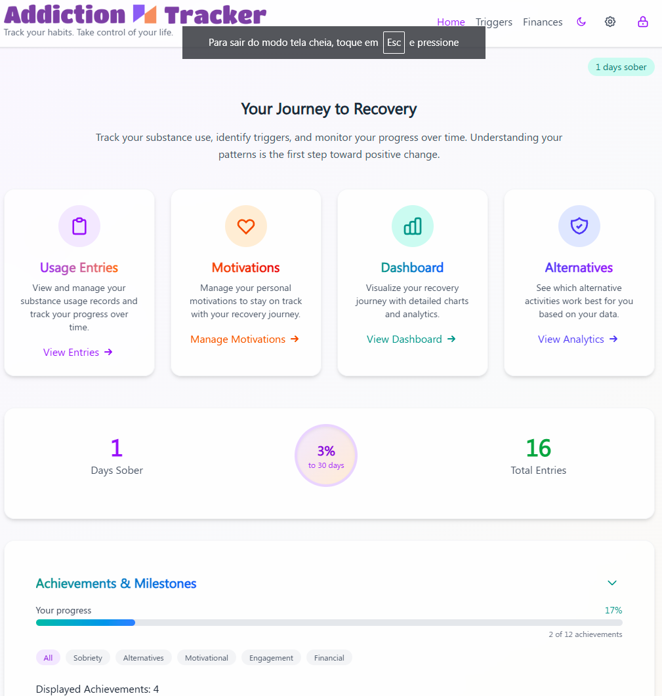

# Addiction tracker
Track your habits. Take control of your life.

## Summary

**Addiction Tracker** is a cross-platform desktop and mobile application built with Angular and Tauri. The app helps users monitor and manage their habits or addictions by providing tracking tools, analytics, and reminders. It supports secure local storage, customizable tracking categories, and visual progress reports to support users in their recovery or self-improvement journeys.

## Download

[Get it from Google Play Store](https://play.google.com/apps/internaltest/4701747893206657408)

## Developing

To start developing, provide the api keys and other information on src/environments/.env and run `npm run config` to generate the environment.ts file.

## Recommended IDE Setup

[VS Code](https://code.visualstudio.com/) + [Tauri](https://marketplace.visualstudio.com/items?itemName=tauri-apps.tauri-vscode) + [rust-analyzer](https://marketplace.visualstudio.com/items?itemName=rust-lang.rust-analyzer) + [Angular Language Service](https://marketplace.visualstudio.com/items?itemName=Angular.ng-template).
